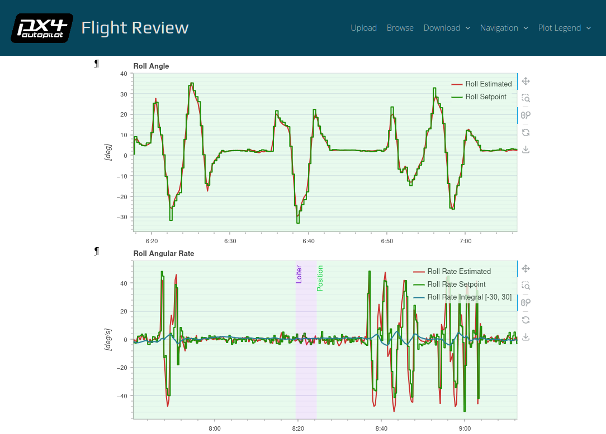

# Flight Review

This is a web application for flight log analysis. It allows users to upload
ULog flight logs, and analyze them through the browser.

It uses the [bokeh](http://bokeh.pydata.org) library for plotting and the
[Tornado Web Server](http://www.tornadoweb.org).

Flight Review is deployed at https://review.px4.io.



## 3D View


## Installation and Setup

### Requirements

- Python3 (3.6+ recommended)
- SQLite3
- [http://fftw.org/](http://fftw.org/)

#### Ubuntu

```bash
sudo apt-get install sqlite3 libfftw3-bin libfftw3-dev
```

**Note:** Under some Ubuntu and Debian environments you might have to
install ATLAS

```bash
sudo apt-get install libatlas3-base
```

#### macOS

macOS already provides SQLite3.
Use [Homebrew](https://brew.sh) to install fftw:

```bash
brew install fftw
```

### Installation

```bash
# After git clone, enter the directory
git clone --recursive https://github.com/PX4/flight_review.git
cd flight_review/app
pip install -r requirements.txt
# Note: preferably use a virtualenv

# Note: if you get an error about "ModuleNotFoundError: No module named 'libevents_parse'" update submodules
git submodule update --init --recursive
```

### Setup

Initialize the Database as following:

```bash
./app/setup_db.py
```

**Note:** `setup_db.py` can also be used to upgrade the database tables, for instance when new entries are added (it automatically detects that).

#### Settings

- By default the app will load `config_default.ini` configuration file
- You can override any setting from `config_default.ini` with a user config file
  `config_user.ini` (untracked)
- Any setting on `config_user.ini` has priority over
  `config_default.ini`

## Usage

For local usage, the server can be started directly with a log file name,
without having to upload it first:

```bash
cd app
./serve.py -f <file.ulg>
```

To start the whole web application:
```bash
cd app
./serve.py --show
```

The `plot_app` directory contains a bokeh server application for plotting. It
can be run stand-alone with `bokeh serve --show plot_app` (or with `cd plot_app;
bokeh serve --show main.py`, to start without the html template).

The whole web application is run with the `serve.py` script. Run `./serve.py -h`
for further details.

## Interactive Usage
The plotting can also be used interative using a Jupyter Notebook. It
requires python knowledge, but provides full control over what and how to plot
with immediate feedback.

- Start the notebook
- Locate and open the test notebook file `testing_notebook.ipynb`.

```bash
# Launch jupyter notebook
cd app
jupyter notebook testing_notebook.ipynb
```

# Implementation
The web site is structured around a bokeh application in `app/plot_app`
(`app/plot_app/configured_plots.py` contains all the configured plots). This
application also handles the statistics page, as it contains bokeh plots as
well. The other pages (upload, browse, ...) are implemented as tornado handlers
in `app/tornado_handlers/`.

`plot_app/helper.py` additionally contains a list of log topics that the plot
application can subscribe to. A topic must live in this list in order to be
plotted.

Tornado uses a single-threaded event loop. This means all operations should be
non-blocking (see also http://www.tornadoweb.org/en/stable/guide/async.html).
(This is currently not the case for sending emails).

Reading ULog files is expensive and thus should be avoided if not really
necessary. There are two mechanisms helping with that:
- Loaded ULog files are kept in RAM using an LRU cache with configurable size
  (when using the helper method). This works from different requests and
  sessions and from all source contexts.
- There's a LogsGenerated DB table, which contains extracted data from ULog
  for faster access.

## Caching
In addition to in-memory caching there is also some on-disk caching: KML files
are stored on disk. Also the parameters and airframes are cached and downloaded
every 24 hours. It is safe to delete these files (but not the cache directory).

## Notes about python imports
Bokeh uses dynamic code loading and the `plot_app/main.py` gets loaded on each
session (page load) to isolate requests. This also means we cannot use relative
imports. We have to use `sys.path.append` to include modules in `plot_app` from
the root directory (Eg `tornado_handlers.py`). Then to make sure the same module
is only loaded once, we use `import xy` instead of `import plot_app.xy`.
It's useful to look at `print('\n'.join(sys.modules.keys()))` to check this.

# Docker usage

This section explains how to work with docker.

## Arguments

Edit the `.env` file according to your setup:

- PORT - The number of port, what listen service in docker, default 5006
- USE_PROXY - The set his, if you use reverse proxy (Nginx, ...)
- DOMAIN - The address domain name for origin, default = *
- CERT_PATH - The SSL certificate volume path
- EMAIL - Email for challenging Let's Encrypt DNS

## Paths

- /opt/service/config_user.ini - Path for config
- /opt/service/data - Folder where stored database
- .env - Environment variables for nginx and app docker container

## Build Docker Image

```bash
cd app
docker build -t px4flightreview -f Dockerfile .
```

## Work with docker-compose
Run the following command to start docker container.
Please modify the `.env` and add `app/config_user.ini` with respective stages.

Uncomment the `BOKEH_ALLOW_WS_ORIGIN` with your local IP Address when
developing, this is for the bokeh application's websocket to work.

### Development
```bash
docker-compose -f docker-compose.dev.yml up
```

### Test Locally
Test locally with nginx:

```bash
docker-compose up
```

Remember to Change `NGINX_CONF` to use `default_ssl.conf` and add the `EMAIL`
for production.

### Production
```bash
htpasswd -c ./nginx/.htpasswd username
# here to create a .htpasswd for nginx basic authentication
chmod u+x init-letsencrypt.sh
./init-letsencrypt.sh
```

## Contributing
Contributions are welcome! Just open a pull request with detailed description
why the changes are needed, or open an issue for bugs, feature requests, etc...

Feel free to run `./run_pylint.sh` before PR to ensure CICD checks pass on your code. 
